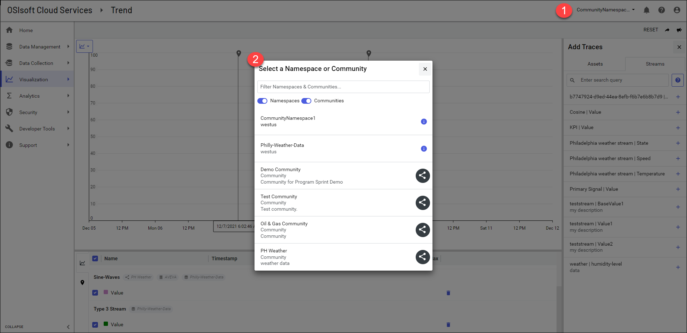
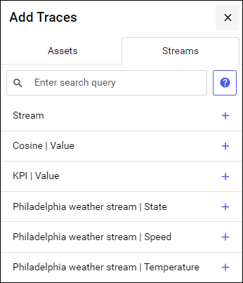

# Get started with trend data

Use trace data in a trend session to monitor assets, anticipate problems, and proactively perform preventative maintenance. The following procedure describes how to display traces in your trend and glean useful information from your data.

Follow this procedure to create a trending session:

1. In the left pane, select **Visualization** > **Trend**.
   
1. In the `Trend` pane, add asset or stream data to the trend session. 

    Add assets from your tenant or add stream data from your tenant or a community.

    1. From the **Namespace** dropdown list (callout **1** in the image below), select a namespace or community that contains data that you want to visualize (callout **2**).

    

    1. In the `Add Traces` pane, select the **Assets** or **Streams** tab, and then select the **Add** 
     icon to add a trace to the trend session.

    **Tip:** Specify the asset/stream name or description in the **Search** box to find the streams you are interested in.
    
    

    1. (Optional) Repeat these substeps to add more traces from different namespaces and communities to the trend session.  

    **Tip:** After you have finished adding the traces, select the **Close**  icon in the `Add Traces` pane to hide the pane and maximize the available area to display your trend session.
        
1. From the **Change Y-axis Mode**  menu, select a view:

    | Trend View | Icon | Description |
    |--|--|--|
    | Single mode |   | Each trace is displayed in its own trend. |
    | Multiple mode |  | All measurements are plotted on the same scale. |
    | Stacked mode |  | All measurements are plotted on its own scale. |

1. From the **Time picker**, select the time range to view. 

    
    
    - Select the **Quick Ranges** tab to choose a predefined time range.
    
    - Select the **Custom Range** tab to choose your own time range.

1. Select **Step backward**  or **Step forward**  to move the time range of the data displayed in the trend session.

   The trace will move in time increments displayed in the time range picker. For example, if the trend session displays the last 8 hours, **Step backward**  shows the previous 8-hour period. If it displays the last 30 days, **Step forward**  shows the next 30-day period. Select the triangle to select another time range or specify a custom range.

   The [legend table](xref:LegendTableReference) displays the [Trend view](xref:LegendTableReference#trend-view) . It shows the legend for each trace, the last value, minimum, maximum, and average values in the displayed time range.

1. From the legend table, select a trace to select it for further analysis.

    The selected trace is highlighted and two cursors automatically mark the minimum and maximum values for the displayed time range. These cursors, called *easy cursors,* remain as long as the trace is highlighted.

    

1. Select the **Add**  icon above the trace to lock the cursors in place.
    
    The **Add**  icon turns into a **Close**  icon. To unlock the cursor, select the **Close**  icon.

    **Note:** When two cursors are locked, the [Legend table](xref:LegendTableReference) displays summary calculations for the values between the two cursors, known as the [Cursor view](xref:LegendTableReference#cursor-view) .

1. Select the **Share**  icon in the menu bar to copy the URL of the workspace. 

    You can share this URL with colleagues to give them the same view of the trend session that they can use to troubleshoot problems.
