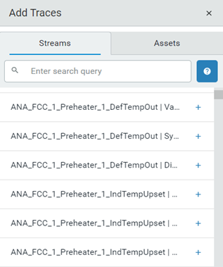
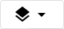
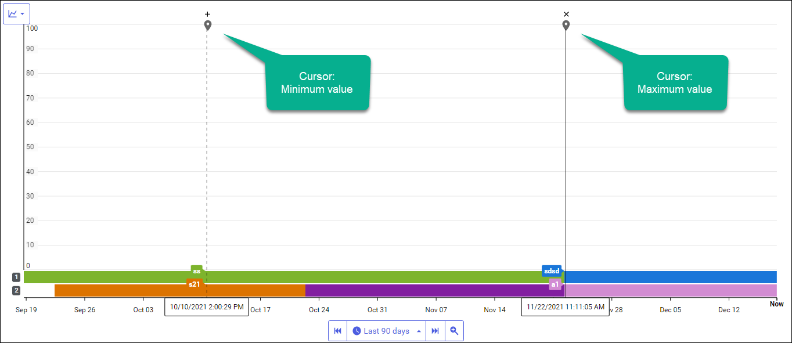
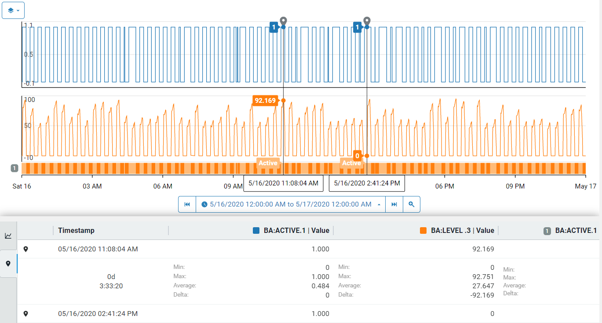
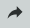

# Get started with trend data

Use trace data in a trend to monitor assets, anticipate problems, and proactively perform preventative maintenance. The following procedure describes how to display traces in your trend and glean useful information from your data.

## Procedure

1. In the left pane, select **Visualization** > **Trend**.
   
1. In the Add Traces blade, click the **+** sign to add the trace to the trend. 

   **Tips:**

   - Specify the stream name or description in the **Search** box to find the streams you are interested in.

   - After you have finished adding the traces, click the **x** in the `Add Traces` pane to hide the pane and maximize the available area to display your trend.

    
   
4. Click the  icon to choose one of the three views:

   | Trend View                               | Description                                     |
   | ---------------------------------------- | ----------------------------------------------- |
   | Single mode   | Each trace is displayed in its own trend.       |
   | Multiple mode            | All measurements are plotted on the same scale. |
   | Stacked mode | All measurements are plotted on its own scale.  |
   

5. Click the time picker  and select the time range you want to view. If the desired time range does not appear in this list, click the **Custom Range** tab and specify your time range.

6. Click the **Step backward** or **Step forward** arrows on the time picker to move the time range of the data displayed in the trend.

   **Note:** The trace will move in time increments displayed in the time range picker. If the trend displays the last 8 hours, **Step backward** shows the previous 8-hour period. If it displays the last 30 days, **Step forward** shows the next 30-day period. Click the triangle to select another time range or specify a custom range.

   The legend table below the trend displays the Trace view. It shows the legend for each trace, the last value, minimum, maximum, and average values in the displayed time range.

1. Click on a trace to select it for further analysis. The selected trace is highlighted, and two cursors automatically mark the minimum and maximum values for the displayed time range. These cursors, called *easy cursors,* remain as long as the trace is highlighted.

    

1. Click the plus sign (+) above the trace to lock the cursors in place.
    
    The **+** turns into an **x**.  To unlock the cursor, click the **x**.

    **Note:** When two cursors are locked, the Legend table displays summary calculations for the values between the two cursors, known as the Cursor view.

    

1. Click the share icon  in the menu bar to copy the URL of the workspace. 

    You can share this URL with colleagues to give them the same view of the trend which they can use to troubleshoot problems.

## Related topics

[Context switch in visual trending](xref:ContextSwitch)
