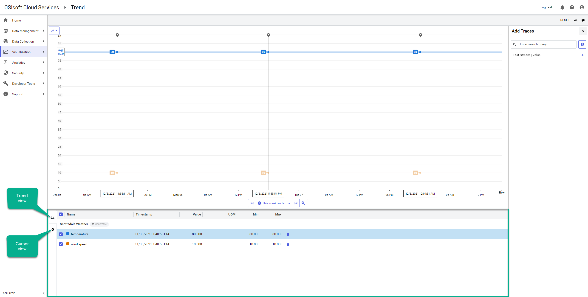
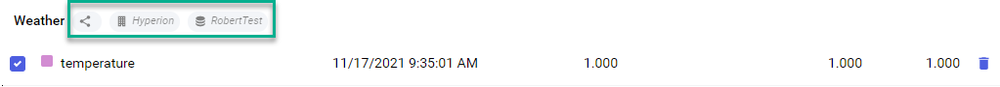
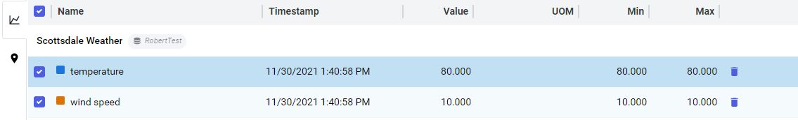
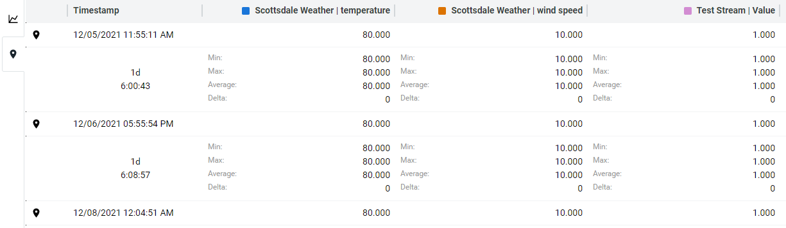

# Legend table reference

On the `Trend` page, a legend table below the `Trend` pane lists information about the traces plotted within the trend session. You can toggle this legend table between two views: a **Trend**  view and a **Cursor** .

## Trend view

The **Trend**  view lists each trace depicted within the trend session. A trace is a stream or asset property data plotted in the session. 

Each trace is listed within the **Trend**  view. Each trace listed includes icons (image below) that display more information about the trace origin:

The following table describes each icon.

Icon | Description
--|--
 | Indicates the origin namespace of the trace.
 | Indicates that the trace originates from a [community](xref:communities). Mouse over the icon to view the community identifier.
 | Indicates the tenant that is sharing the trace within the community. This icon displays only when the trace is shared within a community.

Under each trace, the legend table lists each property added, along with additional data for the property. The following table describes the columns in the legend tabl

Column | Description
--|--
Name | The name of the trace property depicted within the `Trend` pane. The color swatch for each property corresponds to its plotting within the trend session.
Timestamp | The date and time of the trace.
Value | The value of the property.
UOM | The unit of measure.
Min | The lowest value recorded for the property for easy cursors set in the **Trend** view.
Max | The highest value recorded for the property for easy cursors set in the **Trend** view. 

Each property also includes controls to edit the trend session visualization:

* Select or clear the property checkboxes to display or hide the trace property in the trend session.

* Select the **Delete**  icon to remove the trace property from the trend session.

## Cursor view

The **Cursor**  view lists property values for each cursor added to the `Trend` pane. Cursors are listed chronologically according to their timestamps.

**Tip:** For more information on placing cursors, see <xref:GettingStartedWithTrendData>.
