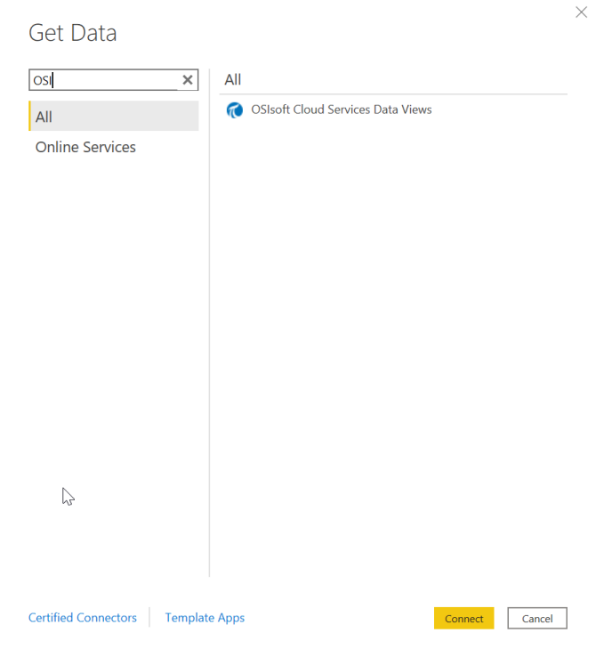
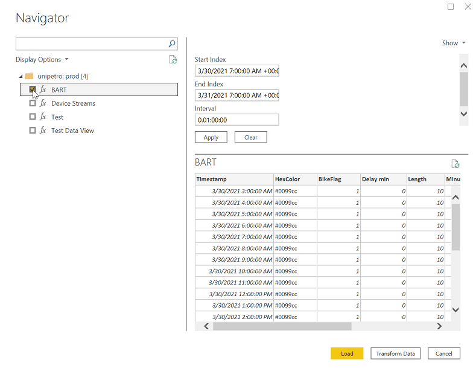
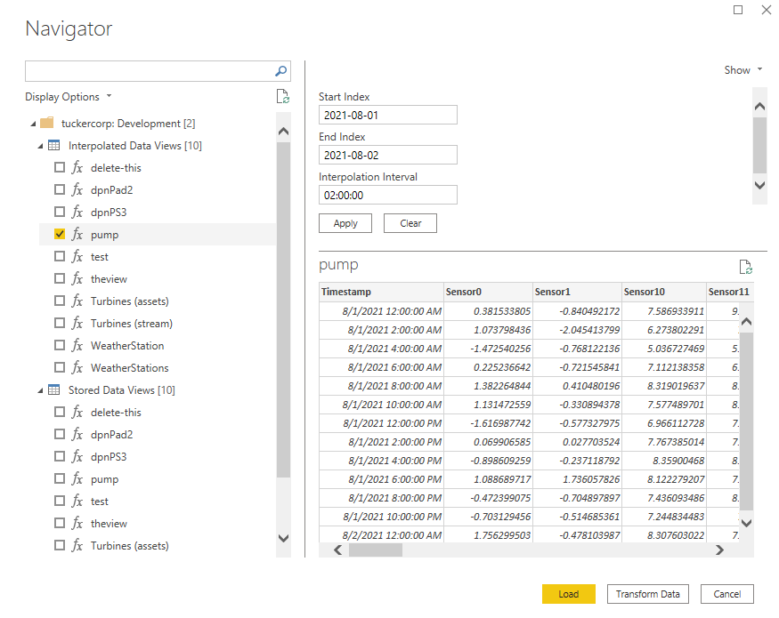
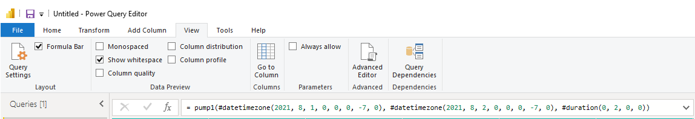
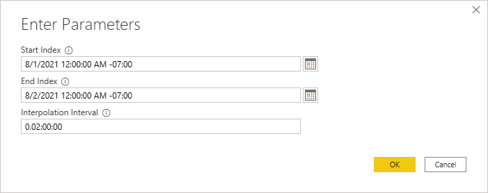
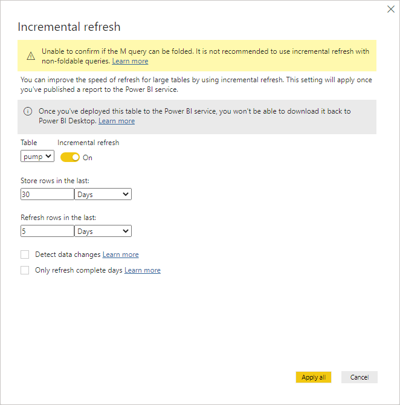

# OSIsoft Cloud Services Power BI Connector

The OSIsoft Cloud Services Power BI Connector retrieves Data Views from OCS and makes them available in Microsoft Power BI for advanced data visualization and analysis. Install OSIsoft Cloud Services Power BI Connector to retrieve Data Views for use with Microsoft Power BI as described in this section. 

## System requirements

The following are required before you install and use OSIsoft Cloud Services Power BI Connector.

- Operation Systems: Windows 10, Windows Server 2012 R2, Windows 8.1, Windows Server 2016, Windows Server 2019

- For desktop installation: Microsoft Power BI Desktop 2.91.884.0 or later

- For on-premises Data Gateway installation: Microsoft Power BI On-premises Data Gateway 3000.89.6 or later

- Microsoft Edge WebView 2 Runtime

- A user account with Administrator privileges to install OSIsoft Cloud Services Power BI Connector on a local machine.

## Install OSIsoft Cloud Services Power BI Connector

1. Download the `OCSPowerBIConnector.exe` file from the [OSIsoft Customer portal](https://customers.osisoft.com/s/products).

1. Install OSIsoft Cloud Services Power BI Connector by either the setup wizard or silent installation.

    - Setup wizard
        - Double click the `OCSPowerBIConnector.exe` file and select **Next**. 
        - Optional: To install the connector to an on-premises data gateway, select `On-premises data gateway installation` and enter the directory where you want to install the connector. 

    - Silent installation
        - Open a command prompt window and type following command: 
        `.\OCSDataConnectorInstaller.exe -Y INSTALLDIR="<install path>" /quiet` 

             **Note:** OSIsoft Cloud Services Power BI Connector supports silent installation for on-premises data gateway installations.

## Retrieve Data Views with OSIsoft Cloud Services Power BI Connector

Use OSIsoft Cloud Services Power BI Connector to retrieve OCS Data Views for use in Microsoft Power BI.

1. In Microsoft Power BI Desktop, in the entry field of the `Get Data` window, type `OSI`. The OSIsoft Cloud Services Data Views connector file displays in the `All` pane.

   

1. Click the `OSIsoft Cloud Services Data Views` connector file, and then click **Connect**.

1. Click **Continue** in the `Connecting to a third-party service` warning.

1. In the `OSIsoft Cloud Services Data Views` window, enter the OCS tenant and namespace for the Data Views you want to access, and then click **OK**. The OSIsoft Cloud Services sign-in window displays if you have not already signed into OCS.

    - If you have not already signed into OCS, click **Sign in as different user** and complete the OCS user authentication process.

1. In the `OSIsoft Cloud Services Data Views` sign-in window, click **Connect**. The `Navigator` pane displays.

1. In the `Navigator` pane, click on either **Interpolated Data Views** or **Stored Data Views**, and select the Data View you want to work with in Microsoft Power BI. Choose **Interpolated Data Views** to get data using the interpolated retrieval mode. Choose **Stored Data Views** to get data using the stored retrieval mode.

   

1. For stored Data Views, specify a Start Index and End Index in `YYYY-MM-DDTHH:mm:ss` format for the selected data view, and click **Apply** to save the values. For interpolated Data Views, also specify an Interpolation Interval in `dd.hh:mm:ss` format. Repeat for each additional data view as needed.

    **Note**: If a data view has default values, enter new values and click **Apply** to accept the defaults.

   

1. Click **Load** at the bottom of the `Navigator` pane to load all selected Data Views to Microsoft Power BI. 

## Edit the Data View query in Microsoft Power BI

Use Microsoft Power BI to edit the query generated from the connector to modify the Start Index and End Index to fixed dates or relative dates, as well as edit the Interpolation Interval (if applicable). You can also use Microsoft Power BI to enable an incremental refresh of data.

1. In Microsoft Power BI, click **Transform data** to view the query with Power Query Editor. 

1. Click **View**, and then select **Formula Bar** to view the query function from the connector.  
     
 As shown in the example, the function begins with the first set of code for the Start Index, `#datetimezone(2021, 8, 1, 0, 0, 0, -7, 0)`, followed by the second set for the End Index, `#datetimezone(2021, 8, 2, 0, 0, 0, -7, 0)`, and lastly the Interpolation Interval, `#duration(0, 2, 0, 0)`.

1. Modify the Start Index and End Index to fixed dates or to relative dates in the function with Power Query M Formula Language code.  
    - Modify for fixed dates: 
        a. Navigate to `APPLIED STEPS`in the `Query Settings` pane, right-click on the parameter labeled, `Invoked Function <nameofdataview>`, and then select `Edit Settings` in the dropdown menu.  
        b. Edit the parameter values for Start Index and End Index. If applicable, edit the Interpolation Interval.  
        
    - Modify for relative dates: 
        a. Edit the query function with Power Query M Formula Language code. For information about Power Query M Formula Language code, see the Microsoft [Power Query M formula language](https://docs.microsoft.com/en-us/powerquery-m/) and [Power Query M function reference](https://docs.microsoft.com/en-us/powerquery-m/power-query-m-function-reference) page on functions you can use in your query. Below are common relative time configurations you can use in your query function.

        | Query function description                                                      | Code                          |
        |-------------------------------------------------------------------------------------------------|-------------------------------|
        | Rolling 2 month period Start Index: 2 months ago End Index: Now | `Date.AddMonths(DateTimeZone.LocalNow(), -2), DateTimeZone.LocalNow()` |
        | Rolling 1 day period Start Index: 1 day ago End Index: Now | `Date.AddDays(DateTimeZone.LocalNow(), -1), DateTimeZone.LocalNow()` |
        | Start of last month through now Start Index: First day of last month at midnight End Index: Now | `Date.StartOfMonth(Date.AddMonths(DateTimeZone.LocalNow(), -1)), DateTimeZone.LocalNow()` | 

1. Click **Close & Apply**, and then select `Close & Apply` in Power Query Editor to save your query.
1. Optional. Use Microsoft Power BI Desktop to enable an incremental refresh of data.  
     a. In Microsoft Power BI, click **Transform data** to open Power Query Editor.  
     b. Click **Manage Parameters**, and then select `Manage Parameters` in the menu.  
     c. Add the following parameters in the `Manage Parameters` window, and then click **OK**. 
        | Parameter              | Code                          |
         |---------------------|-------------------------------|
        | `RangeStart` | Description: `<optional>`  Required: `selected`  Type: `Date/Time`  Suggested Values: `<Any value>, <List of values>, <Query>`  Current Value: `<Start date of the date range>` |
        | `RangeEnd` | Description: `<optional>`  Required: `selected`  Type: `Date/Time`  Suggested Values: `<Any value>, <List of values>, <Query>`  Current Value: `<End date of the date range>` |
     **Note:** `RangeStart` and `RangeEnd` must be named and mixed-cased as is for incremental refresh to work. Type must always be `Date/Time`.

     d. Edit the query function to use the `RangeStart` and `RangeEnd` parameters defined in the previous step. For example,
     `DateTimeZone.From(RangeStart), DateTimeZone.From(RangeEnd), #duration(0, 1, 0, 0)`.  
     e. Click **Close & Apply**, and then select `Close & Apply` in Power Query Editor.  
     f. Click **Home**, and in the `Fields` pane right-click your data view type, and then choose `Incremental Refresh` in the dropdown menu.  
     g. Turn on `Incremental Refresh`, edit the values in the `Store rows in the last` fields, and click **Apply all** to save. This builds a cache of data in Microsoft Power BI so you will not need to re-query the original data view.  
      
     This example shows that incremental refresh is turned on, will cache 30 days of data, and the last 5 days will be a rolling refresh of data.  
    For more information about incremental refresh, see the Microsoft  [Incremental refresh for datasets](https://docs.microsoft.com/en-us/power-bi/connect-data/incremental-refresh-overview) page.
