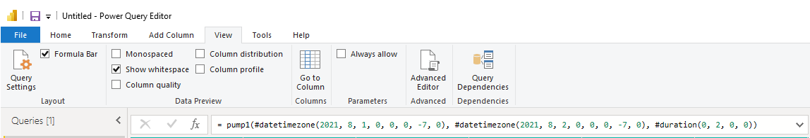
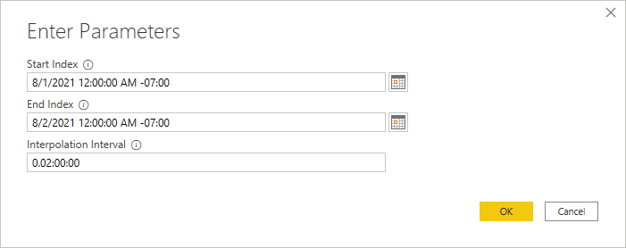
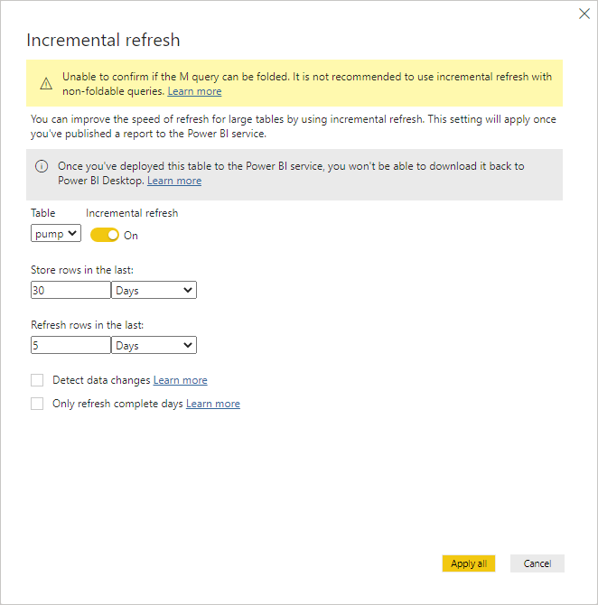

# Edit a Data View query in Microsoft Power BI

Use Microsoft Power BI to edit a query generated from the connector to modify the Start Index and End Index to fixed dates or relative dates, as well as edit the Interpolation Interval (if applicable). You can also use Microsoft Power BI to enable an incremental refresh of data.

1. In Microsoft Power BI, select **Transform data** to view the query with Power Query Editor.

1. Select **View**, and then select **Formula Bar** to view the query function from the connector.

   
    
   As shown in the example, the function begins with the first set of code for the Start Index, `#datetimezone(2021, 8, 1, 0, 0, 0, -7, 0)`, followed by the second set for the End Index, `#datetimezone(2021, 8, 2, 0, 0, 0, -7, 0)`, and lastly the Interpolation Interval, `#duration(0, 2, 0, 0)`.

1. Modify the Start Index and End Index to fixed dates or to relative dates in the function with Power Query M Formula Language code.

   - Modify for fixed dates:
    
     a. Navigate to `APPLIED STEPS` in the `Query Settings` pane, right-click on the parameter labeled `Invoked Function <nameofdataview>`, and then select **Edit Settings** in the dropdown menu.
        
     b. Edit the parameter values for Start Index and End Index. If applicable, edit the Interpolation Interval.
        
     

   - Modify for relative dates:
    
     a. Edit the query function with Power Query M Formula Language code. For information about Power Query M Formula Language code, see [Microsoft Power Query M formula language](https://docs.microsoft.com/en-us/powerquery-m/) and [Power Query M function reference](https://docs.microsoft.com/en-us/powerquery-m/power-query-m-function-reference) for functions you can use in your query. Below are common relative time configurations you can use in your query function.

     | Query function description                                                      | Code                          |
     |---------------------------------------------------------------------------------|-------------------------------|
     | Rolling 2 month period Start Index: 2 months ago End Index: Now | `Date.AddMonths(DateTimeZone.LocalNow(), -2), DateTimeZone.LocalNow()` |
     | Rolling 1 day period Start Index: 1 day ago End Index: Now | `Date.AddDays(DateTimeZone.LocalNow(), -1), DateTimeZone.LocalNow()` |
     | Start of last month through now Start Index: First day of last month at midnight End Index: Now | `Date.StartOfMonth(Date.AddMonths(DateTimeZone.LocalNow(), -1)), DateTimeZone.LocalNow()` |

1. Select **Close & Apply**, and then select **Close & Apply** in Power Query Editor to save your query.

1. (Optional) Use Microsoft Power BI Desktop to enable an incremental refresh of data.

   a. In Microsoft Power BI, select **Transform data** to open Power Query Editor.
     
   b. Select **Manage Parameters**, and then select **Manage Parameters** in the menu.
     
   c. Add the following parameters in the `Manage Parameters` window, and then select **OK**.
     
      | Parameter              | Code                          |
      |---------------------|-------------------------------|
      | `RangeStart` | Description: `<optional>`  Required: `selected`  Type: `Date/Time`  Suggested Values: `<Any value>, <List of values>, <Query>`  Current Value: `<Start date of the date range>` |
      | `RangeEnd` | Description: `<optional>`  Required: `selected`  Type: `Date/Time`  Suggested Values: `<Any value>, <List of values>, <Query>`  Current Value: `<End date of the date range>` |
     
      **Note:** `RangeStart` and `RangeEnd` must be named and mixed-cased as is for incremental refresh to work. Type must always be `Date/Time`.

   d. Edit the query function to use the `RangeStart` and `RangeEnd` parameters defined in the previous step. For example:
     
      `DateTimeZone.From(RangeStart), DateTimeZone.From(RangeEnd), #duration(0, 1, 0, 0)`
     
   e. Select **Close & Apply**, and then select **Close & Apply** in Power Query Editor.
     
   f. Select **Home**, and in the `Fields` pane, right-click the data view type, and then choose **Incremental Refresh** in the dropdown menu.
     
   g. Turn on `Incremental Refresh`, edit the values in the `Store rows in the last` fields, and select **Apply all** to save.

      This builds a cache of data in Microsoft Power BI so you will not need to re-query the original data view. The following example image shows that incremental refresh is turned on, will cache 30 days of data, and the last 5 days will be a rolling refresh of data.
        
      

    For more information about incremental refresh, see the Microsoft [Incremental refresh for datasets](https://docs.microsoft.com/en-us/power-bi/connect-data/incremental-refresh-overview) page.
