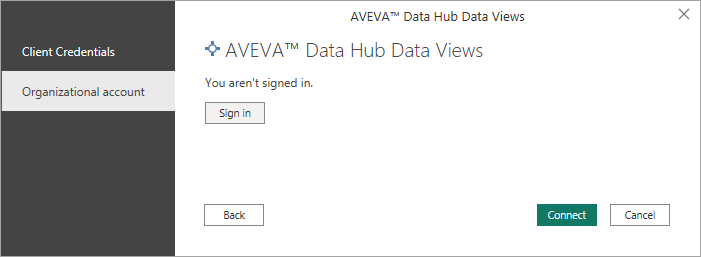

# Retrieve data views with Power BI Connector

Use AVEVA Power BI Connector to retrieve AVEVA Data Hub data views for use in Microsoft Power BI.

## Prerequisites

While retrieving a data view from AVEVA Data Hub, AVEVA Power BI Connector prompts you to authenticate with Microsoft Power BI. You have two options for authentication:

- **(Recommended) Client-credential client**

    Use an AVEVA Data Hub client-credential client Id and client secret to authenticate with Microsoft Power BI. This authentication option is preferred over organizational account because it allows Microsoft Power BI to remain securely connected with AVEVA Data Hub without prompting you to reauthenticate every seven days.

    If you choose this option, you must create and configure a client-credential client for use during authentication. These credentials are used while completing [To retrieve data views](#to-retrieve-data-views). For instructions on creating these credentials, see <xref:gpClientCredentialsClient>. While creating the credentials, select one or more **Tenant Roles** that provide access to the data view, applying the concept of <xref:LeastPrivilege>. While creating the credentials, record the **Client Id** and **Client Secret** to enter while retrieving a data view.

- **Organizational account**

    Authenticate the connection between AVEVA Data Hub and Microsoft Power BI using the same organizational account that you use to sign into AVEVA Data Hub. If you use this authentication option, Power BI Connector prompts you to reauthenticate the connection every seven days.

    If you choose this authentication option, you can begin [To retrieve data views](#to-retrieve-data-views) without completing any prerequisites.

## To retrieve data views

1. Open Microsoft Power BI Desktop. In the entry field of the `Get Data` window, type `AVEVA`.

    The AVEVA Data Hub data views connector file displays in the `All` pane.

   

1. Select the `AVEVA Data Hub Data Views` connector file, and then select **Connect**.

1. Select **Continue** in the `Connecting to a third-party service` warning.

1. In the `AVEVA Data Hub Data Views` window, enter the tenant and namespace for the data views you want to access, and then select **OK**.

1. Authenticate the connection between AVEVA Data Hub and Microsoft Power BI.

   - **Client Credentials:**

       

       Select **Client Credentials**. Then enter the **ClientId** and the **Client Secret** for the client credential clients that you created while fulfilling the [Prerequisites](#prerequisites).

   - **Organizational Account:**

       

       Select **Organizational account**. Then select **Log in**. Then enter the credentials you use to sign in with AVEVA Data Hub.

1. Select **Connect** to connect AVEVA Data Hub to Microsoft Power BI.

1. In the `Navigator` pane, choose a data view to work with from either **Interpolated Data Views** or **Stored Data Views**.

   

1. Specify a **Start Index** and **End Index** for the data that you want to work with. Enter the date in `YYYY-MM-DDTHH:mm:ss` format.

   If you are working with an **Interpolated Data Views**, you must specify an **Interpolation Interval** as well. Enter it in `dd.hh:mm:ss` format.

   If a data view you are working with has default index values or default interpolation interval values defined, you can override them by entering new values and selecting **Apply**.

   

1. Select **Load** at the bottom of the `Navigator` pane to load all selected data views to Microsoft Power BI.
