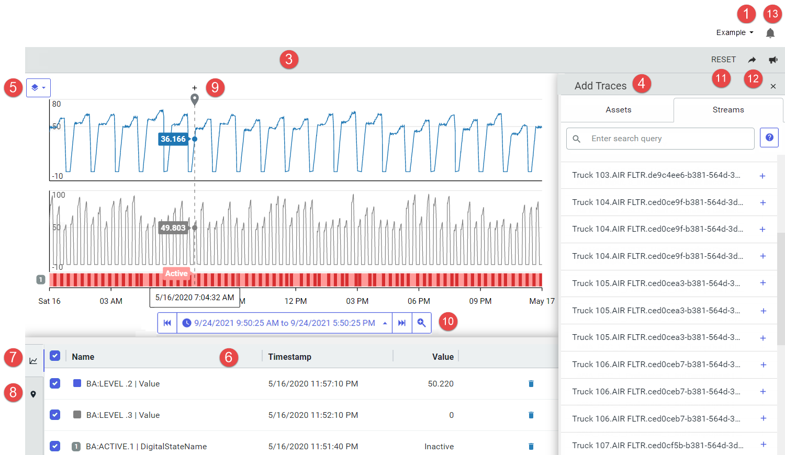

# Trend page

The screen capture and table below identify the important elements of the Trend user interface and how to use these elements to interact with the application. For more information on how to use the Trend page to analyze traces, see [Get Started with Trend Data](xref:GettingStartedWithTrendData).

| Number | Description                                                  |
| ------ | ------------------------------------------------------------ |
| 1      | Tenant &ndash; Click the triangle and select the tenant from the list. |
| 2      | Namespace &ndash; Click the triangle and select the namespace from the list. |
| 3      | Trend pane &ndash; Displays the selected traces. Line traces are displayed for numeric data and heat maps are displayed for string or enumerated data. |
| 4      | Add Traces pane &ndash; Click the plus symbol (+) to add the trace to the trend pane. |
| 5      | Trend mode &ndash; Click to toggle between the stacked, single-scale, and multi-scale view modes. |
| 6      | Legend table &ndash; Displays information about the traces in the Trend pane. Toggle between the Trend and Cursor views. |
| 7      | Trend view &ndash; Click the Trend icon to display statistics about each trace in the Legend table. The screen capture shows the trend view. |
| 8      | Cursor view &ndash; Click the Cursor icon to display cursor statistics in the Legend table. The cursor must be locked&mdash;click the plus symbol (+) above the cursor&mdash;in order to display the statistics. With two or more locked cursors, summary statistics are displayed for contiguous cursors. |
| 9      | Cursor &ndash; Place cursors to get minimum, maximum, average, and delta values between two points in time. |
| 10     | Time range picker &ndash; Specify the time range by selecting a time range, specifying a custom range, or using the step forward and step backward arrows. |
| 11     | Reset &ndash; Clears the workspace.                          |
| 12     | Share &ndash; Copies the workspace URL. Use this to share your workspace with others. |
| 13     | Notifications &ndash; Click to display error messages.       |